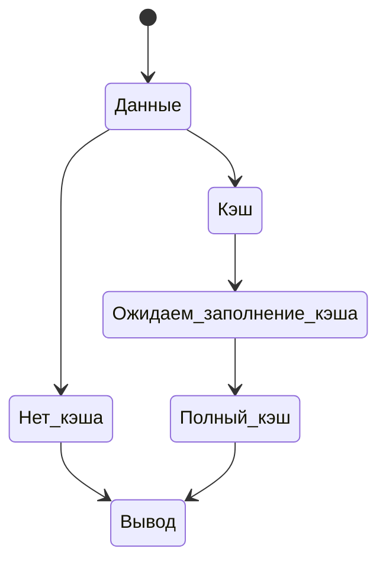

# Не корректно работают функции flush и ob_flush на сервере с php в режиме FastCGI

Код, активно использующий flush и ob_flush для контроля выходного потока в скриптах php(встречал даже скрипт отдающий данные медиапотока с помощью данными функциями управления потоком и отдачи заголовка Range для нужной порции данных) может корректно работать на тестовом стенде с mod_php(PHP как модуль Apache), и не корректно – на серверах с конфигурацией, отличной от локального тестового сервера.

Так получается потому, что данный код корректно работает из коробки только  на сервере со связкой Apache+mod_php или Apache+CGI, и то, только если на сервере отключено сжатие gzip.

На серверах с Nginx+Apache+mod_fcgid скрипты использующие flush и ob_flush() будут выводить информацию не постепенно, а сразу. 
Так происходитиз-за того, что веб-сервер nginx использует сжатие gzip, а модуль gzip использует специальный буфер, и отдаёт данные не по указке PHP, а по мере заполнения данного буфера. Также обработчики PHP, выполняемые в режиме FastCGI, используют свой буфер, размер которого задаётся параметром FcgidOutputBufferSize. 

Логика работы буферов следующая:

В результате использования данных буферов данные выводимые в стандартный выходной поток php не отдаётся сразу посетителю сайта, а проходят через
два буфера, каждый из которых накапливает данные и сбрасывает их в выходной поток только в случаях, когда: 

1. Буфер заполнился, и данные можно отправлять получателю. 

2. Скрипт завершил свою работу, и данных от буфера больше не будет.

Цепочка буферов, по которым проходят данные хорошо описана в следующем материале <http://www.binarytides.com/output-buffering-php-apache/> 
Только к на серверах с Nginx в качестве фронтенда к ней нужно добавить ещё один буфер(буфер модуля gzip веб-сервера nginx).

Так как изменять размер FcgidOutputBufferSize с дефолтного на 0 не желательно из-за того, что это негативно влияет на производительность сервера, если скрипт расположен на одном сервере с другими скриптами, не имеющими подобных требований к кэшам веб-сервера, такой скрипт лучше от остальных скриптов отселить на отдельную VPS с настроенной для него связкой Apache+mod\_php. Где для обеспечения корректной работы данных функций потребуется отключить сжатие. 

Если вместо mod_php принято решение перенести скрипт на отдельную VPS с PHP в режиме FastCGI, необходимо будет значение FcgidOutputBufferSize сделать
равным 0 в /etc/httpd/conf.d/fcgid.conf. 

После чего flush и ob flush() будут работать так, как ожидают разработчики и на сервере с Nginx+Apache+mod\_fcgid.

Полезная информация:
<https://forums.iis.net/t/1078563.aspx?PHP+Output+Buffer+Flushing>
<http://www.binarytides.com/output-buffering-php-apache/>
<https://www.virtualmin.com/node/15328>
<http://httpd.apache.org/mod_fcgid/mod/mod_fcgid.html#fcgidoutputbuffersize>
<http://stackoverflow.com/questions/2481858/how-to-make-php-generate-chunked-response>
<http://stackoverflow.com/questions/7178514/php-flush-stopped-flushing-in-iis7-5>
<http://stackoverflow.com/questions/3483035/php-flushing-output-as-soon-as-you-call-echo>
<http://stackoverflow.com/questions/3133209/how-to-flush-output-after-each-echo-call>